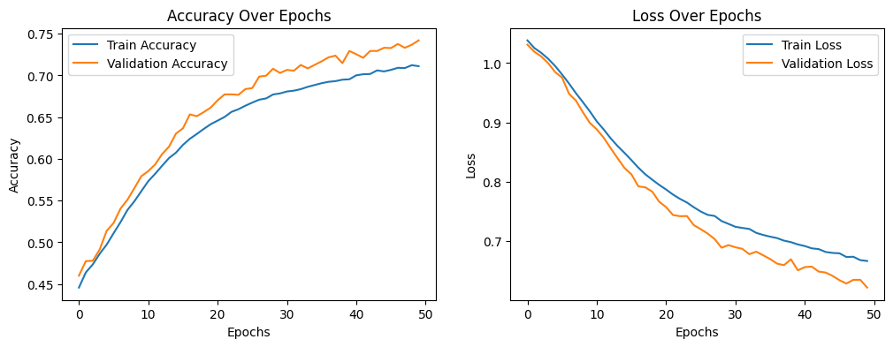
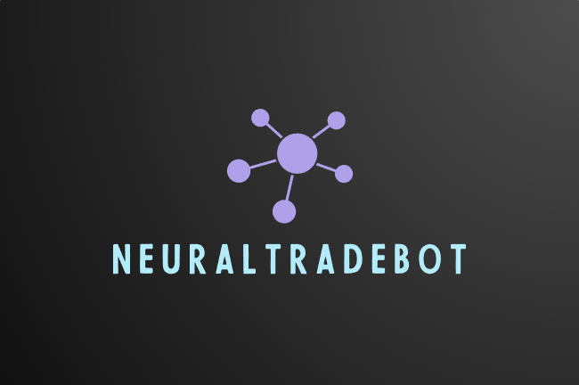

# NeuralBotTrade

**NeuralBotTrade** es un bot de trading algorítmico para Bitcoin en Bybit. Utiliza una red neuronal convolucional que analiza datos técnicos, blockchain, sentimiento en redes, y otros indicadores para predecir movimientos de precio. Desarrollado en Python, desplegado en Google Cloud con Docker y Airflow, y registra operaciones en una base de datos PostgreSQL.

## Tabla de Contenidos

1. [Instalación](#instalación)
2. [Uso](#uso)
3. [Características](#características)
4. [Configuración](#configuración)
5. [Documentación](#documentación)
6. [Contribuir](#contribuir)
7. [Licencia](#licencia)
8. [Contacto](#contacto)

## Instalación

Sigue estos pasos para instalar y configurar **NeuralBotTrade** en tu entorno en la nube:

1. **Clonar el Repositorio**:

   Primero, clona el repositorio desde GitHub:

   ```bash
   git clone https://github.com/aseba10/NeuralTradeBot.git
   
   cd NeuralTradeBot
   
2. **Configurar el Archivo `config.py`**:

   Abre el archivo `dags/settings/config.py` y completa los siguientes valores:

   ```python
   ORDER_SIZE_DEFAULT = [Tu valor aquí] #este valor es el monto en usd de cada orden, por defecto 10
   
   PROFIT_MARGIN = [Tu valor aquí] #se ejecutará una orden de venta siempre que supere este margen de take profit con respecto a una orden de compra ejecutada, por defecto 3%
   
   BYBIT_API_KEY = "Tu API Key de Bybit"
   
   BYBIT_API_SECRET = "Tu API Secret de Bybit"
   ```

3. **Instalar Docker y Docker Compose** (si no están instalados):

   Si no tienes Docker y Docker Compose instalados en tu host, sigue estas instrucciones:

   - **Instalar Docker**:
     - En sistemas basados en Debian/Ubuntu:
       ```bash
       sudo apt-get update
       sudo apt-get install docker-ce docker-ce-cli containerd.io
       ```

   - **Instalar Docker Compose**:
     - Descarga la última versión:
       ```bash
       sudo curl -L "https://github.com/docker/compose/releases/download/v2.28.1/docker-compose-$(uname -s)-$(uname -m)" -o /usr/local/bin/docker-compose
       sudo chmod +x /usr/local/bin/docker-compose
       ```

4. **Construir y Levantar los Contenedores**:

   Desde el directorio `NeuralTradeBot`, ejecuta los siguientes comandos para construir y levantar los contenedores:

   ```bash
   # Construir los contenedores (solo si es necesario)
   docker-compose build

   # Levantar los contenedores
   docker-compose up -d
   ```

Estos pasos te configurarán el entorno necesario para ejecutar **NeuralTradeBot** en tu máquina virtual.

## Características

El bot accede a la API de Bybit para descargar los datos más recientes, y luego genera más de 40 indicadores de análisis técnico, cubriendo tendencias, momentum, volatilidad, volumen, entre otros. Posteriormente, se ejecuta una función adicional que genera otro tipo de indicadores y datos, incluyendo información de otros activos, análisis de sentimiento en redes sociales, movimientos en la blockchain, indicadores macroeconómicos, entre otros.


Estos datos son procesados por un modelo de redes neuronales convolucionales, el cual produce señales de compra, venta o mantenimiento. El proceso incluye una función de etiquetado basada en criterios específicos de evolución del precio en rondas futuras. Tras aplicar técnicas de escalado y sobremuestreo, se entrena el modelo que genera las señales correspondientes.




Además, se establecen reglas de gestión de capital, como el número máximo de operaciones diarias y las condiciones de take profit. Si se cumplen estas reglas, se ejecuta la orden y se registra en la base de datos PostgreSQL.

## Uso

Una vez que hayas completado la instalación, sigue estos pasos para utilizar **NeuralBotTrade**:

1. **Acceder a Airflow**:

   **NeuralBotTrade** utiliza Airflow para la orquestación de tareas. Para acceder a la interfaz de Airflow y verificar que los DAGs (Directed Acyclic Graphs) se están ejecutando correctamente, sigue estos pasos:

   - **Accede a la interfaz de Airflow** en tu navegador web. Si estás utilizando Google Cloud, la URL suele ser algo como `http://[IP_O_DOMINIO_DEL_SERVIDOR]:8080`.
   - **Inicia sesión** con las credenciales configuradas en tu archivo `docker-compose.yml`.
   - **Verifica los DAGs** y sus estados en la interfaz para asegurarte de que se están ejecutando según lo esperado.

2. **Acceder a PostgreSQL**:

   **NeuralBotTrade** registra las operaciones en una base de datos PostgreSQL. Puedes acceder a PostgreSQL para ver las órdenes que se están ejecutando utilizando herramientas de administración de bases de datos o directamente desde la línea de comandos.

Estos pasos te permitirán monitorear y gestionar el funcionamiento de **NeuralBotTrade** a través de Airflow y PostgreSQL.

3. **Backtesting**:

   Para evaluar el rendimiento del bot y analizar las señales generadas, puedes utilizar el archivo `botCNN/bot_backtesting.ipynb`. Este cuaderno de Jupyter te permitirá visualizar gráficamente las señales generadas por el bot y ver cuáles de ellas cumplieron con las reglas de gestión de dinero y fueron ejecutadas.

   - **Abrir el Cuaderno**: Navega a `botCNN/bot_backtesting.ipynb` en tu entorno de trabajo.
   - **Ejecutar el Cuaderno**: Abre el cuaderno en Jupyter y ejecuta las celdas para cargar los datos y generar los gráficos.
   - **Analizar los Resultados**: El gráfico resultante mostrará las señales del bot y destacará cuáles fueron ejecutadas conforme a las reglas establecidas. Esto te permitirá evaluar la efectividad de las estrategias del bot.

Este proceso de backtesting es fundamental para verificar la estrategia del bot y ajustar los parámetros según sea necesario.




## Configuración

El bot se configura a través del archivo `config.py` en el directorio `dags/settings`. Asegúrate de completar todos los valores necesarios antes de ejecutar el bot.

## Documentación

Para más detalles sobre la configuración avanzada y el uso de **NeuralTradeBot**, consulta la [documentación](link_to_docs).

## Contribuir

¡Contribuciones son bienvenidas! Para contribuir, sigue estos pasos:

```bash
# Clonar el repositorio
git clone https://github.com/aseba10/NeuralTradeBot.git

# Crear una rama nueva
git checkout -b nombre-de-tu-rama

# Hacer cambios y hacer commit
git commit -m "Descripción del cambio"

# Enviar los cambios al repositorio
git push origin nombre-de-tu-rama

# Crear un Pull Request en GitHub
```

## Licencia

Este proyecto está bajo la Licencia MIT. Ver el archivo [LICENSE](LICENSE) para más detalles.

## Contacto

Para preguntas o sugerencias, puedes contactarme en [sebastianalvarezdata@gmail.com](mailto:sebastianalvarezdata@gmail.com).

